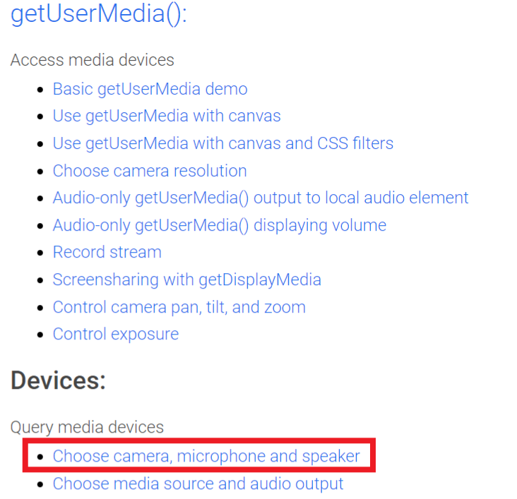
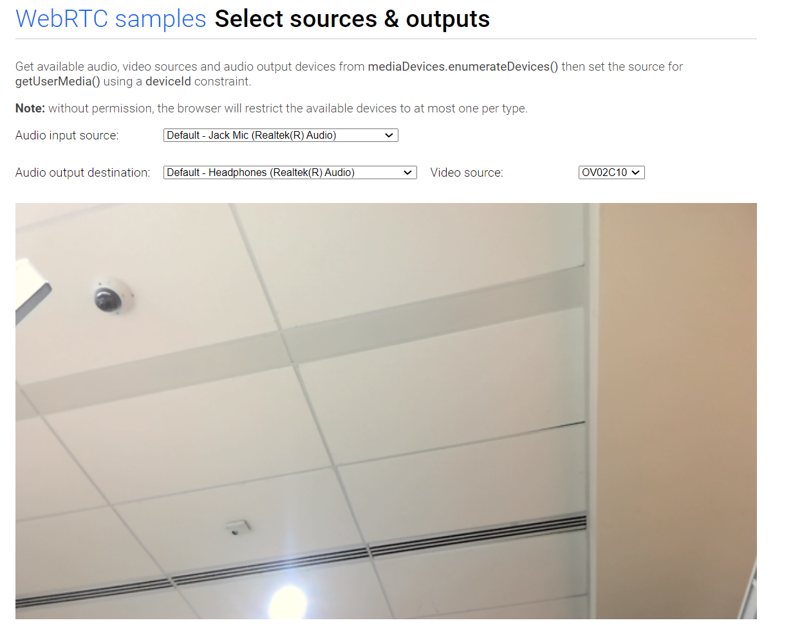
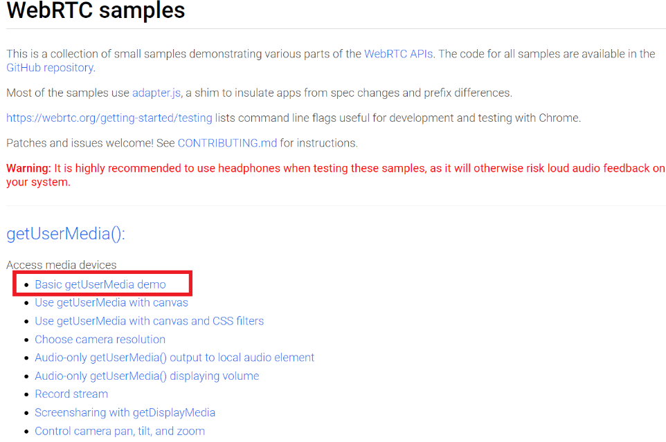
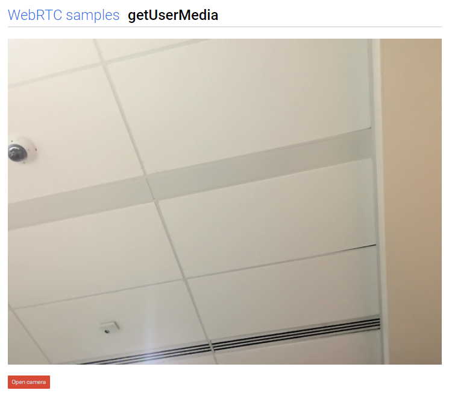
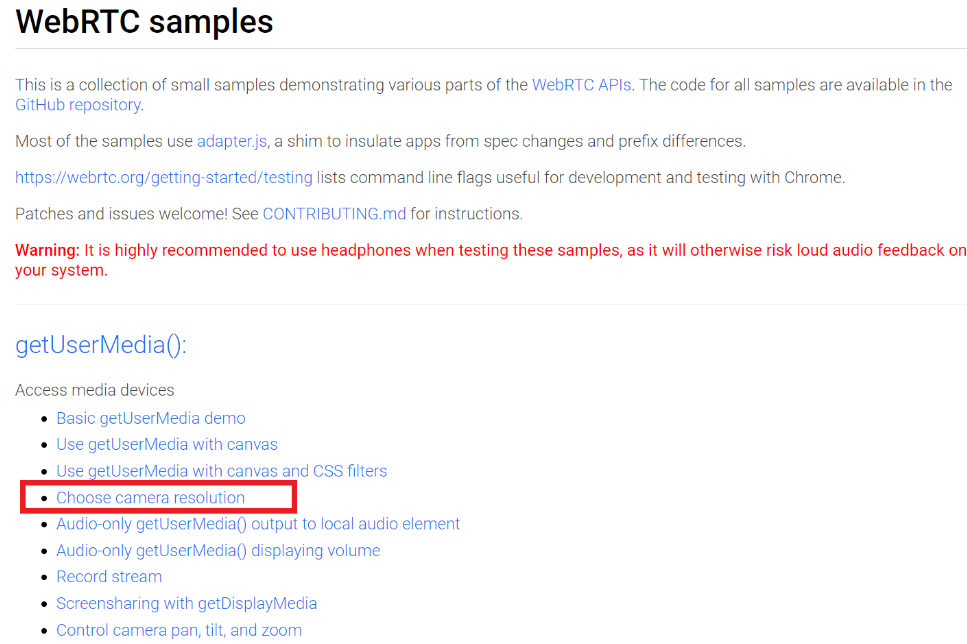
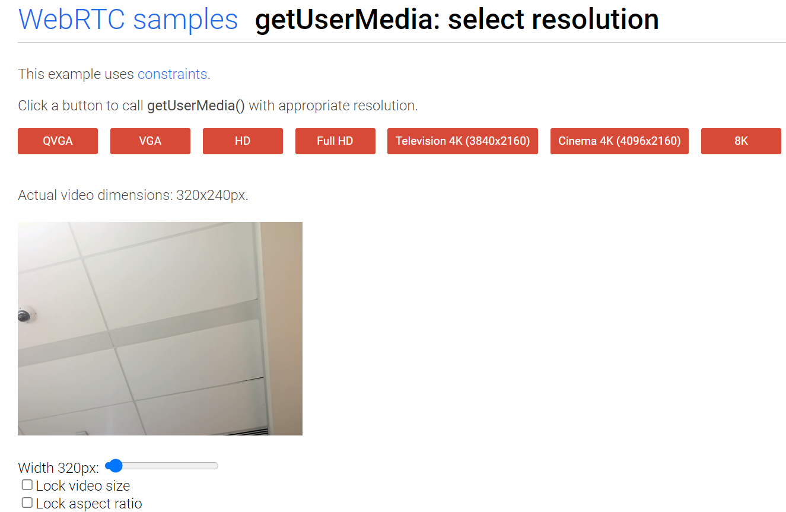

# Instructions

## Required materials
* spencer-gen2 board
* meta-spencer

## Prerequisite
* Logged into a shell console
* Connect to wifi(see qvts/wifi.md)
* Append the following line to the /etc/resolve.conf => nameserver 8.8.8.8
* Unmute the speaker and enable the capture from the microphone (see qvts/audio.md) 
  to verify audio related things
* **Below changes must be applied on the target(/etc/iptables/) to verify data transfer.**
  **These changes allow the data transfer by accepting the incoming traffic**
```
diff --git a/recipes-extended/iptables/iptables/iptables.rules b/recipes-extended/iptables/iptables/iptables.rules
index 0888006..35c1149 100644
--- a/recipes-extended/iptables/iptables/iptables.rules
+++ b/recipes-extended/iptables/iptables/iptables.rules
@@ -3,7 +3,7 @@
# ---------------------------------------------------------------------------------------------------------------------
 
*filter
-:INPUT DROP [0:0]
+:INPUT ACCEPT [0:0]
:FORWARD DROP [0:0]
:OUTPUT ACCEPT [0:0]
-A INPUT -i lo -j ACCEPT
```

## Version Info
* Qtwebengine_Version => 6.2.6
* Chromium_Version    => 94.0.4606.126

## Start the simple browser application
```
root@spencer-gen2:~#
root@spencer-gen2:~# echo nameserver 8.8.8.8 >> /etc/resolv.conf
root@spencer-gen2:~# export QTWEBENGINE_DISABLE_SANDBOX=1
root@spencer-gen2:~# export QT_QPA_EGLFS_FORCE888=24
root@spencer-gen2:~# /usr/share/examples/webenginewidgets/simplebrowser/simplebrowser https://webrtc.github.io/samples/                                                    
QEglFSVivIntegration will set environment variable FB_MULTI_BUFFER=2 to enable double buffering and vsync.
 If this is not desired, you can override this via: export QT_EGLFS_IMX6_NO_FB_MULTI_BUFFER=1
Sandboxing disabled by user.
qt.webenginecontext: 

GL Type: egl
Surface Type: OpenGLES
Surface Profile: NoProfile
Surface Version: 3.1
QSG RHI Backend: OpenGL
Using Supported QSG Backend: yes
Using Software Dynamic GL: no
Using Multithreaded OpenGL: yes

Init Parameters:
  *  application-name simplebrowser 
  *  browser-subprocess-path /usr/libexec/QtWebEngineProcess 
  *  disable-features ConsolidatedMovementXY,InstalledApp,BackgroundFetch,WebOTP,WebPayments,WebUSB,PictureInPicture 
  *  disable-speech-api  
  *  enable-features NetworkServiceInProcess,TracingServiceInProcess 
  *  enable-threaded-compositing  
  *  enable-use-zoom-for-dsf false 
  *  in-process-gpu  
  *  no-sandbox  
  *  use-gl egl 

js: Error with Permissions-Policy header: Unrecognized feature: 'interest-cohort'.
 
```
# Testing instructions
## Query the Video and Audio devices

* A screen similar to the one shown below will appear on the display.
* Click on the highlighted link, similar to the one shown in the image, to query the video and audio devices from the 
  browser



* Afterwards, a new tab resembling the one displayed below will open on the screen.
* Within this tab, one can view the various audio and video devices available on the board.
* The selected camera from the **video source** dropdown will provide a preview on the screen.



## Camera Testing

* A screen similar to the one shown below will appear on the display.
* Click on the highlighted link, similar to the one shown in the image, to test the camera streaming in browser




* Afterwards, a new tab resembling the one displayed below will open on the screen.
* Within this tab, click the button **open camera** and give the access to camera 
* Then a preview of the camera will be displayed on the screen



## Choosing different camera resolutions

* A screen similar to the one shown below will appear on the display.
* Click on the highlighted link, similar to the one shown in the image, to check the different camera resolutions 



* Afterwards, a new tab resembling the one displayed below will open on the screen.
* Within this tab, one can select for various camera resolutions—such as QVGA, VGA, HD, and Full HD and preview them accordingly.
  


## Taking the snapshot from the browser

* A screen similar to the one shown below will appear on the display.
* Click on the highlighted link, similar to the one shown in the image, to take a snapshot from the camera


* Afterwards,a new tab resembling the one displayed below will open on the screen.
* Within this tab, One can take a snapshot by clicking the **Take snapshot** button there


## Testing Audio output

* A screen similar to the one shown below will appear on the display.
* Click on the highlighted link, similar to the one shown in the image, to test the audio output from the browser


* Afterwards, new tab resembling the one displayed below will open on the screen.
* Within this tab, users can play the second video and listen to the audio through the speakers.


## Testing basic peer to peer connection


* A screen similar to the one shown below will appear on the display.
* Click on the highlighted link, similar to the one shown in the image, to test the peer to peer connection


* Afterwards, new tab resembling the one displayed below will open on the screen.
* Open two separate tabs using the same highlighted link and proceed to click **Start** in both tabs.
* This action will display side-by-side camera previews from both tabs.


## Testing data transfer 

* A screen similat to the one shown below will appear on the display.
* Click on the highlighted link, similat to the one shown in the image, to test the data transfer


* Afterwards, new tab resembling the one displayed below will open on the screen.
* Within this tab, click the button **Generate and send data** and then the user will be
  notified after successfull data transfer completion similar to the below image


# GPU Verification Test 

* GPU usage for Camera Streaming in https://webrtc.github.io/samples/src/content/getusermedia/resolution/ with **FULL HD**

```
root@spencer-gen2:~#
root@spencer-gen2:~# gmem_info
 Pid          Total      Reserved    Contiguous       Virtual      Nonpaged    Name
 1344    49,640,046    47,182,446     2,457,600             0             0    /usr/share/examples/webenginewidgets/simplebrowser/simplebrowser
 ------------------------------------------------------------------------------
    1    49,640,046    47,182,446     2,457,600             0             0    Summary
    -             -   221,253,010             -             -             -    Available
GPU Idle time:  85525.093750 ms
root@spencer-gen2:~# 
root@spencer-gen2:~#
root@spencer-gen2:~# top
Mem: 849324K used, 893140K free, 30460K shrd, 11740K buff, 327732K cached
CPU: 29.0% usr  2.5% sys  0.0% nic 67.8% idle  0.0% io  0.4% irq  0.0% sirq
Load average: 0.51 0.50 0.37 2/212 1410
  PID  PPID USER     STAT   VSZ %VSZ CPU %CPU COMMAND
 1394  1344 root     S     671m 39.3   0 18.7 /usr/libexec/QtWebEngineProcess --type=utility --utility-sub-type=video_capture.mojom.V
 1344  1071 root     S    2189m128.2   2  9.1 /usr/share/examples/webenginewidgets/simplebrowser/simplebrowser https://webrtc.github.
 1382  1349 root     S    25.1g1509.1   1  3.1 /usr/libexec/QtWebEngineProcess --type=renderer --webengine-schemes=qrc:sV --no-sandbo
  184     2 root     SW<      0  0.0   3  0.1 [galcore_deamon/]
 1410  1071 root     R     3508  0.2   1  0.0 top
  111     2 root     IW       0  0.0   1  0.0 [kworker/1:2-eve]
   34     2 root     IW       0  0.0   2  0.0 [kworker/2:1-eve]
 1305     2 root     IW       0  0.0   0  0.0 [kworker/0:0-eve]

=> Approximately 67.8% of cpu is idle and about 31% of cpu is used by the simplebrowser application while streaming the camera in FULL HD resolution .
```

* GPU usage for youtube video  (https://www.youtube.com/watch?v=y9n6HkftavM&ab_channel=8KParadise) in 480P

```
root@spencer-gen2:~# 
root@spencer-gen2:~# gmem_info
 Pid          Total      Reserved    Contiguous       Virtual      Nonpaged    Name
 1431    55,458,470    53,000,870     2,457,600             0             0    /usr/share/examples/webenginewidgets/simplebrowser/simplebrowser
 ------------------------------------------------------------------------------
    1    55,458,470    53,000,870     2,457,600             0             0    Summary
    -             -   215,434,586             -             -             -    Available
GPU Idle time:  372820.875000 ms
root@spencer-gen2:~#
root@spencer-gen2:~#
root@spencer-gen2:~# top
Mem: 1042212K used, 700252K free, 51356K shrd, 14124K buff, 344896K cached
CPU: 27.2% usr  3.2% sys  0.0% nic 68.5% idle  0.1% io  0.6% irq  0.1% sirq
Load average: 1.05 1.37 0.76 2/218 1505
  PID  PPID USER     STAT   VSZ %VSZ CPU %CPU COMMAND
1471  1436 root     S    25.2g1516.3   2 21.3 /usr/libexec/QtWebEngineProcess --type=renderer --webengine-schemes=qrc:sV --no-sandbo
1431  1070 root     S    2406m140.9   2  8.1 /usr/share/examples/webenginewidgets/simplebrowser/simplebrowser https://www.youtube.co
1488  1431 root     S     585m 34.2   0  0.8 /usr/libexec/QtWebEngineProcess --type=utility --utility-sub-type=audio.mojom.AudioServ
  184     2 root     SW<      0  0.0   3  0.3 [galcore_deamon/]
1498  1070 root     R     3508  0.2   3  0.1 top
   33     2 root     IW       0  0.0   0  0.1 [kworker/0:1-eve]
   35     2 root     IW       0  0.0   2  0.1 [kworker/2:1-eve]
1428     2 root     IW       0  0.0   0  0.1 [kworker/0:0-eve]

=>  Approximately 68.2% of cpu is idle and about 31% of cpu is used by the simplebrowser application while playing the youtube video in 480P
```
