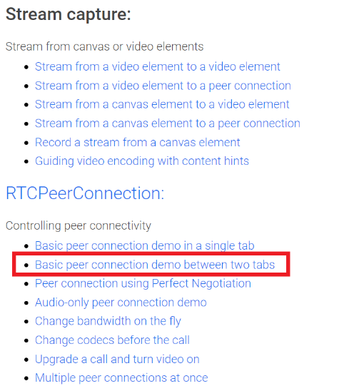
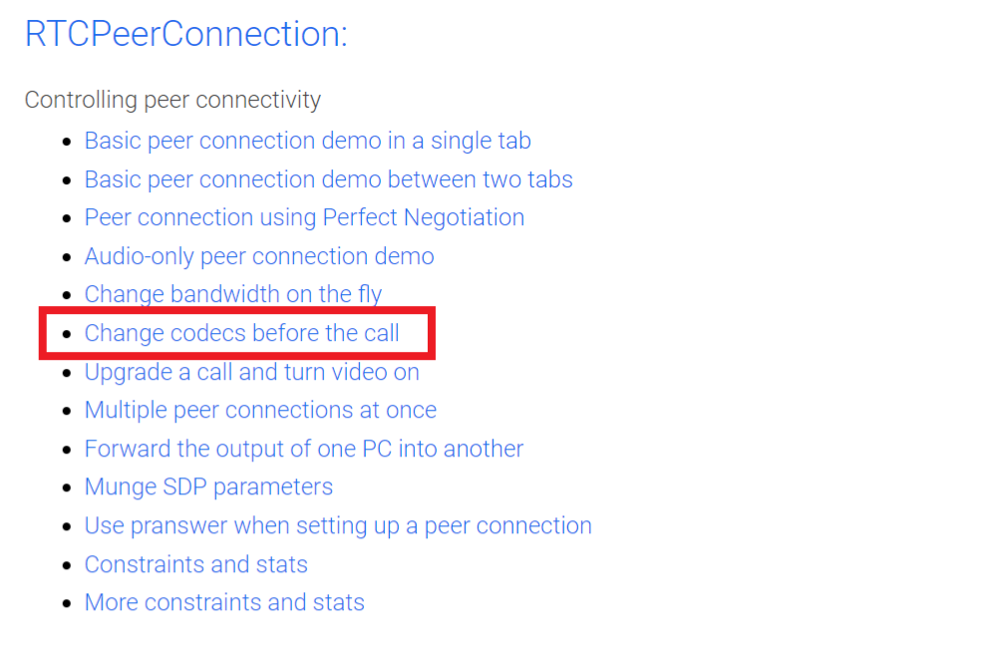

# Instructions

## Required materials
* spencer-gen2 board
* meta-spencer

## Prerequisite
* Logged into a shell console
* Connect to wifi(see qvts/wifi.md)
* Append the following line to the /etc/resolve.conf => nameserver 8.8.8.8
* Unmute the speaker and enable the capture from the microphone (see qvts/audio.md) 
  to verify audio related things
* **Below changes must be applied on the target(/etc/iptables/) to verify data transfer.**
  **These changes allow the data transfer by accepting the incoming traffic**
```
diff --git a/recipes-extended/iptables/iptables/iptables.rules b/recipes-extended/iptables/iptables/iptables.rules
index 0888006..35c1149 100644
--- a/recipes-extended/iptables/iptables/iptables.rules
+++ b/recipes-extended/iptables/iptables/iptables.rules
@@ -3,7 +3,7 @@
# ---------------------------------------------------------------------------------------------------------------------
 
*filter
-:INPUT DROP [0:0]
+:INPUT ACCEPT [0:0]
:FORWARD DROP [0:0]
:OUTPUT ACCEPT [0:0]
-A INPUT -i lo -j ACCEPT
```

## Version Info
* Qtwebengine_Version => 6.2.6
* Chromium_Version    => 94.0.4606.126

## Start the simple browser application
```
root@spencer-gen2:~#
root@spencer-gen2:~# systemctl stop spencer-splash.service
root@spencer-gen2:~# echo nameserver 8.8.8.8 >> /etc/resolv.conf
root@spencer-gen2:~# export QTWEBENGINE_DISABLE_SANDBOX=1
root@spencer-gen2:~# export QT_QPA_EGLFS_FORCE888=24
root@spencer-gen2:~# /usr/share/examples/webenginewidgets/simplebrowser/simplebrowser https://webrtc.github.io/samples/                                                    
QEglFSVivIntegration will set environment variable FB_MULTI_BUFFER=2 to enable double buffering and vsync.
 If this is not desired, you can override this via: export QT_EGLFS_IMX6_NO_FB_MULTI_BUFFER=1
Sandboxing disabled by user.
qt.webenginecontext: 

GL Type: egl
Surface Type: OpenGLES
Surface Profile: NoProfile
Surface Version: 3.1
QSG RHI Backend: OpenGL
Using Supported QSG Backend: yes
Using Software Dynamic GL: no
Using Multithreaded OpenGL: yes

Init Parameters:
  *  application-name simplebrowser 
  *  browser-subprocess-path /usr/libexec/QtWebEngineProcess 
  *  disable-features ConsolidatedMovementXY,InstalledApp,BackgroundFetch,WebOTP,WebPayments,WebUSB,PictureInPicture 
  *  disable-speech-api  
  *  enable-features NetworkServiceInProcess,TracingServiceInProcess 
  *  enable-threaded-compositing  
  *  enable-use-zoom-for-dsf false 
  *  in-process-gpu  
  *  no-sandbox  
  *  use-gl egl 

js: Error with Permissions-Policy header: Unrecognized feature: 'interest-cohort'.
 
```
# Testing instructions
## Query the Video and Audio devices

* A screen similar to the one shown below will appear on the display.
* Click on the highlighted link, similar to the one shown in the image, to query the video and audio devices from the 
  browser


* Afterwards, a new tab resembling the one displayed below will open on the screen.
* Within this tab, one can view the various audio and video devices available on the board.
* The selected camera from the **video source** dropdown will provide a preview on the screen.


## Camera Testing

* A screen similar to the one shown below will appear on the display.
* Click on the highlighted link, similar to the one shown in the image, to test the camera streaming in browser


* Afterwards, a new tab resembling the one displayed below will open on the screen.
* Within this tab, click the button **open camera** and give the access to camera 
* Then a preview of the camera will be displayed on the screen


## Choosing different camera resolutions

* A screen similar to the one shown below will appear on the display.
* Click on the highlighted link, similar to the one shown in the image, to check the different camera resolutions 


* Afterwards, a new tab resembling the one displayed below will open on the screen.
* Within this tab, one can select for various camera resolutions—such as QVGA, VGA, HD, and Full HD and preview them accordingly.
  


## Taking the snapshot from the browser

* A screen similar to the one shown below will appear on the display.
* Click on the highlighted link, similar to the one shown in the image, to take a snapshot from the camera


* Afterwards,a new tab resembling the one displayed below will open on the screen.
* Within this tab, One can take a snapshot by clicking the **Take snapshot** button there


## Testing Audio output

* A screen similar to the one shown below will appear on the display.
* Click on the highlighted link, similar to the one shown in the image, to test the audio output from the browser


* Afterwards, new tab resembling the one displayed below will open on the screen.
* Within this tab, users can play the second video and listen to the audio through the speakers.


## Testing basic peer to peer connection


* A screen similar to the one shown below will appear on the display.
* Click on the highlighted link, similar to the one shown in the image, to test the peer to peer connection



* Afterwards, new tab resembling the one displayed below will open on the screen.
* Open two separate tabs using the same highlighted link and proceed to click **Start** in both tabs.
* This action will display side-by-side camera previews from both tabs.


## Testing data transfer 

* A screen similar to the one shown below will appear on the display.
* Click on the highlighted link, similar to the one shown in the image, to test the data transfer


* Afterwards, new tab resembling the one displayed below will open on the screen.
* Within this tab, click the button **Generate and send data** and then the user will be
  notified after successfull data transfer completion similar to the below image


## Testing the codecs

* A screen similar to the one shown below will appear on the display.
* Click on the highlighted link, similar to the one shown in the image, to test the codecs



* Afterwards, new tab resembling the one displayed below will open on the screen.
* Within this tab, click on the **Start** button.
* Choose your preferred codec from the **Codec preferences** dropdown menu. Once selected, click on the **Call**
  button to display a preview of the call using the chosen codec in the another screen.


# GPU Verification Test 

* CPU usage for Camera Streaming in https://webrtc.github.io/samples/src/content/getusermedia/resolution/ with **FULL HD**

```
root@spencer-gen2:~#
root@spencer-gen2:~# gmem_info
 Pid          Total      Reserved    Contiguous       Virtual      Nonpaged    Name
 1344    49,640,046    47,182,446     2,457,600             0             0    /usr/share/examples/webenginewidgets/simplebrowser/simplebrowser
 ------------------------------------------------------------------------------
    1    49,640,046    47,182,446     2,457,600             0             0    Summary
    -             -   221,253,010             -             -             -    Available
GPU Idle time:  85525.093750 ms
root@spencer-gen2:~# 
root@spencer-gen2:~#
root@spencer-gen2:~# top
Mem: 849324K used, 893140K free, 30460K shrd, 11740K buff, 327732K cached
CPU: 29.0% usr  2.5% sys  0.0% nic 67.8% idle  0.0% io  0.4% irq  0.0% sirq
Load average: 0.51 0.50 0.37 2/212 1410
  PID  PPID USER     STAT   VSZ %VSZ CPU %CPU COMMAND
 1394  1344 root     S     671m 39.3   0 18.7 /usr/libexec/QtWebEngineProcess --type=utility --utility-sub-type=video_capture.mojom.V
 1344  1071 root     S    2189m128.2   2  9.1 /usr/share/examples/webenginewidgets/simplebrowser/simplebrowser https://webrtc.github.
 1382  1349 root     S    25.1g1509.1   1  3.1 /usr/libexec/QtWebEngineProcess --type=renderer --webengine-schemes=qrc:sV --no-sandbo
  184     2 root     SW<      0  0.0   3  0.1 [galcore_deamon/]
 1410  1071 root     R     3508  0.2   1  0.0 top
  111     2 root     IW       0  0.0   1  0.0 [kworker/1:2-eve]
   34     2 root     IW       0  0.0   2  0.0 [kworker/2:1-eve]
 1305     2 root     IW       0  0.0   0  0.0 [kworker/0:0-eve]

=> Approximately 67.8% of cpu is idle and about 31% of cpu is used by the simplebrowser application while streaming the camera in FULL HD resolution .
```

* CPU usage for youtube video (https://www.youtube.com/watch?v=y9n6HkftavM&ab_channel=8KParadise) streamed in 480P

```
root@spencer-gen2:~# 
root@spencer-gen2:~# gmem_info
 Pid          Total      Reserved    Contiguous       Virtual      Nonpaged    Name
 1431    55,458,470    53,000,870     2,457,600             0             0    /usr/share/examples/webenginewidgets/simplebrowser/simplebrowser
 ------------------------------------------------------------------------------
    1    55,458,470    53,000,870     2,457,600             0             0    Summary
    -             -   215,434,586             -             -             -    Available
GPU Idle time:  372820.875000 ms
root@spencer-gen2:~#
root@spencer-gen2:~#
root@spencer-gen2:~# top
Mem: 1042212K used, 700252K free, 51356K shrd, 14124K buff, 344896K cached
CPU: 27.2% usr  3.2% sys  0.0% nic 68.5% idle  0.1% io  0.6% irq  0.1% sirq
Load average: 1.05 1.37 0.76 2/218 1505
  PID  PPID USER     STAT   VSZ %VSZ CPU %CPU COMMAND
1471  1436 root     S    25.2g1516.3   2 21.3 /usr/libexec/QtWebEngineProcess --type=renderer --webengine-schemes=qrc:sV --no-sandbo
1431  1070 root     S    2406m140.9   2  8.1 /usr/share/examples/webenginewidgets/simplebrowser/simplebrowser https://www.youtube.co
1488  1431 root     S     585m 34.2   0  0.8 /usr/libexec/QtWebEngineProcess --type=utility --utility-sub-type=audio.mojom.AudioServ
  184     2 root     SW<      0  0.0   3  0.3 [galcore_deamon/]
1498  1070 root     R     3508  0.2   3  0.1 top
   33     2 root     IW       0  0.0   0  0.1 [kworker/0:1-eve]
   35     2 root     IW       0  0.0   2  0.1 [kworker/2:1-eve]
1428     2 root     IW       0  0.0   0  0.1 [kworker/0:0-eve]

=>  Approximately 68.2% of cpu is idle and about 31% of cpu is used by the simplebrowser application while playing the youtube video in 480P
```

* CPU usage while testing VP8 codec in simple browser

```
root@spencer-gen2:~#
root@spencer-gen2:~#
root@spencer-gen2:~# gmem_info
 Pid          Total      Reserved    Contiguous       Virtual      Nonpaged    Name
 1496    42,544,542    40,086,942     2,457,600             0             0    /usr/share/examples/webenginewidgets/simplebrowser/simplebrowser
 ------------------------------------------------------------------------------
    1    42,544,542    40,086,942     2,457,600             0             0    Summary
    -             -   228,348,514             -             -             -    Available
GPU Idle time:  612.301270 ms
root@spencer-gen2:~#
root@spencer-gen@:~# top
Mem: 852032K used, 890432K free, 17536K shrd, 11616K buff, 266880K cached
CPU: 47.2% usr  7.7% sys  0.0% nic 43.1% idle  0.0% io  1.3% irq  0.5% sirq
Load average: 2.46 2.71 2.02 5/221 1598
  PID  PPID USER     STAT   VSZ %VSZ CPU %CPU COMMAND
 1544  1501 root     S    25.6g1540.9   1 37.6 /usr/libexec/QtWebEngineProcess --type=renderer --webengine-schemes=qrc:sV --no-sandbo
 1496  1072 root     S    2117m124.0   2 12.1 /usr/share/examples/webenginewidgets/simplebrowser/simplebrowser https://webrtc.github.
 1562  1496 root     S     656m 38.4   2  3.5 /usr/libexec/QtWebEngineProcess --type=utility --utility-sub-type=video_capture.mojom.V
 1557  1496 root     S     657m 38.5   2  2.1 /usr/libexec/QtWebEngineProcess --type=utility --utility-sub-type=audio.mojom.AudioServ
  185     2 root     SW<      0  0.0   3  0.3 [galcore_deamon/]
 1589  1072 root     R     3508  0.2   1  0.0 top
   13     2 root     IW       0  0.0   2  0.0 [rcu_preempt]
 1518  1501 root     SN   25.0g1503.9   2  0.0 /usr/libexec/QtWebEngineProcess --type=renderer --webengine-schemes=qrc:sV --no-sandbo
 1501  1496 root     S     293m 17.2   3  0.0 /usr/libexec/QtWebEngineProcess --type=zygote --no-sandbox --application-name=simplebro

=> Approximately 43.1% of cpu is idle and about 56% of cpu is used by the simple browser application while testing the VP8 codec
```

* CPU usage while testing VP9 codec in simple browser

```
root@spencer-gen2:~#
root@spencer-gen2:~# gmem_info
Pid          Total      Reserved    Contiguous       Virtual      Nonpaged    Name
 1496    42,049,438    39,591,838     2,457,600             0             0    /usr/share/examples/webenginewidgets/simplebrowser/simplebrowser
 ------------------------------------------------------------------------------
    1    42,049,438    39,591,838     2,457,600             0             0    Summary
    -             -   228,843,618             -             -             -    Available
GPU Idle time:  961.157227 ms
root@spencer-gen2:~#
root@spencer-gen2:~#
root@spencer-gen2:~# top
Mem: 887412K used, 855052K free, 18908K shrd, 11648K buff, 268252K cached
CPU: 61.7% usr  7.7% sys  0.0% nic 28.5% idle  0.0% io  1.4% irq  0.5% sirq
Load average: 4.51 3.48 2.45 4/217 1617
  PID  PPID USER     STAT   VSZ %VSZ CPU %CPU COMMAND
 1544  1501 root     S    25.6g1541.5   3 52.0 /usr/libexec/QtWebEngineProcess --type=renderer --webengine-schemes=qrc:sV --no-sandbo
 1496  1072 root     S    2118m124.1   3 12.4 /usr/share/examples/webenginewidgets/simplebrowser/simplebrowser https://webrtc.github.
 1562  1496 root     S     657m 38.5   3  3.9 /usr/libexec/QtWebEngineProcess --type=utility --utility-sub-type=video_capture.mojom.V
 1557  1496 root     S     657m 38.5   1  2.2 /usr/libexec/QtWebEngineProcess --type=utility --utility-sub-type=audio.mojom.AudioServ
  185     2 root     SW<      0  0.0   0  0.3 [galcore_deamon/]
  693     2 root     IW       0  0.0   2  0.0 [kworker/2:5-eve]
 1518  1501 root     SN   25.0g1503.9   2  0.0 /usr/libexec/QtWebEngineProcess --type=renderer --webengine-schemes=qrc:sV --no-sandbo
 1501  1496 root     S     293m 17.2   3  0.0 /usr/libexec/QtWebEngineProcess --type=zygote --no-sandbox --application-name=simplebro
 1500  1496 root     S     293m 17.2   1  0.0 /usr/libexec/QtWebEngineProcess --type=zygote --no-zygote-sandbox --no-sandbox --applic

=> Approximately 28.5% of cpu is idle and about 71% of cpu is used by the simple browser application while testing the VP9 codec
```

* CPU usage while testing AV1X codec in simple browser
```
root@spencer-gen2:~#
root@spencer-gen2:~#
root@spencer-gen2:~# gmem_info
 Pid          Total      Reserved    Contiguous       Virtual      Nonpaged    Name
 1496    41,399,982    38,942,382     2,457,600             0             0    /usr/share/examples/webenginewidgets/simplebrowser/simplebrowser
 ------------------------------------------------------------------------------
    1    41,399,982    38,942,382     2,457,600             0             0    Summary
    -             -   229,493,074             -             -             -    Available
GPU Idle time:  444.254730 ms
root@spencer-gen2:~#
root@spencer-gen2:~#
root@spencer-gen2:~# top
Mem: 912644K used, 829820K free, 17764K shrd, 11672K buff, 267108K cached
CPU: 44.1% usr  6.3% sys  0.0% nic 47.8% idle  0.0% io  1.3% irq  0.3% sirq
Load average: 3.14 3.48 2.64 2/220 1642
  PID  PPID USER     STAT   VSZ %VSZ CPU %CPU COMMAND
 1544  1501 root     S    25.7g1547.8   2 35.4 /usr/libexec/QtWebEngineProcess --type=renderer --webengine-schemes=qrc:sV --no-sandbo
 1496  1072 root     S    2117m124.0   0  9.4 /usr/share/examples/webenginewidgets/simplebrowser/simplebrowser https://webrtc.github.
 1562  1496 root     S     657m 38.5   2  3.2 /usr/libexec/QtWebEngineProcess --type=utility --utility-sub-type=video_capture.mojom.V
 1557  1496 root     S     657m 38.5   3  2.1 /usr/libexec/QtWebEngineProcess --type=utility --utility-sub-type=audio.mojom.AudioServ
  185     2 root     SW<      0  0.0   0  0.2 [galcore_deamon/]
 1633  1072 root     R     3508  0.2   2  0.1 top
   13     2 root     IW       0  0.0   1  0.0 [rcu_preempt]
  693     2 root     IW       0  0.0   2  0.0 [kworker/2:5-eve]
 1595     2 root     IW       0  0.0   0  0.0 [kworker/0:0-eve]
 1637     2 root     IW       0  0.0   1  0.0 [kworker/1:0-eve]
 1518  1501 root     SN   25.0g1503.9   0  0.0 /usr/libexec/QtWebEngineProcess --type=renderer --webengine-schemes=qrc:sV --no-sandbo
 1501  1496 root     S     293m 17.2   3  0.0 /usr/libexec/QtWebEngineProcess --type=zygote --no-sandbox --application-name=simplebro
 1500  1496 root     S     293m 17.2   1  0.0 /usr/libexec/QtWebEngineProcess --type=zygote --no-zygote-sandbox --no-sandbox --applic

=> Approximately 47.8% of cpu is idle and about 52% of cpu is used by the simple browser application while testing the AV1X codec
```

# CPU usage when the GPU is disabled

* Launch the simple browser application with the following flag **--disable-gpu** like below to disable the GPU 

```
root@spencer-gen2:~#
root@spencer-gen2:~#
root@spencer-gen2:~# /usr/share/examples/webenginewidgets/simplebrowser/simplebrowser --disable-gpu https://webrtc.github.io/samples/ &
[1] 1090
root@spencer-gen2:~# QEglFSVivIntegration will set environment variable FB_MULTI_BUFFER=2 to enable double buffering and vsync.
 If this is not desired, you can override this via: export QT_EGLFS_IMX6_NO_FB_MULTI_BUFFER=1
Sandboxing disabled by user.
qt.webenginecontext:

GL Type: disabled
Surface Type: OpenGLES
Surface Profile: NoProfile
Surface Version: 3.1
QSG RHI Backend: OpenGL
Using Supported QSG Backend: yes
Using Software Dynamic GL: no
Using Multithreaded OpenGL: yes

Init Parameters:
  *  application-name simplebrowser
  *  browser-subprocess-path /usr/libexec/QtWebEngineProcess
  *  disable-features ConsolidatedMovementXY,InstalledApp,BackgroundFetch,WebOTP,WebPayments,WebUSB,PictureInPicture
  *  disable-gpu
  *  disable-speech-api
  *  enable-features NetworkServiceInProcess,TracingServiceInProcess
  *  enable-threaded-compositing
  *  enable-use-zoom-for-dsf false
  *  in-process-gpu
  *  no-sandbox
  *  use-gl disabled
root@spencer-gen2:~#
```
* Following are the changes that one can notice while the GPU is disabled using the** --disable-gpu** flag from above <br>
   => GL Type **disabled** <br>
   => use-gl  **disabled**

* CPU usage for Camera Streaming in https://webrtc.github.io/samples/src/content/getusermedia/resolution/ with **FULL HD** while GPU is disabled
```
root@spencer-gen2:~#
root@spencer-gen2:~# top
Mem: 806824K used, 935640K free, 43088K shrd, 10872K buff, 283860K cached
CPU: 32.3% usr  1.5% sys  0.0% nic 65.7% idle  0.0% io  0.4% irq  0.0% sirq
Load average: 2.29 3.13 2.81 2/215 1823
  PID  PPID USER     STAT   VSZ %VSZ CPU %CPU COMMAND
 1805  1656 root     S     674m 39.5   0 19.8 /usr/libexec/QtWebEngineProcess --type=utility --utility-sub-type=video_capture.mojom.V
 1656  1072 root     S    2063m120.9   0  8.0 /usr/share/examples/webenginewidgets/simplebrowser/simplebrowser --disable-gpu https://
 1791  1661 root     S    25.1g1509.8   3  5.5 /usr/libexec/QtWebEngineProcess --type=renderer --webengine-schemes=qrc:sV --no-sandbo
  185     2 root     SW<      0  0.0   3  0.1 [galcore_deamon/]
 1677  1661 root     SN   25.0g1503.9   0  0.0 /usr/libexec/QtWebEngineProcess --type=renderer --webengine-schemes=qrc:sV --no-sandbo
 1705  1656 root     S     729m 42.7   1  0.0 /usr/libexec/QtWebEngineProcess --type=utility --utility-sub-type=audio.mojom.AudioServ
 1660  1656 root     S     293m 17.2   3  0.0 /usr/libexec/QtWebEngineProcess --type=zygote --no-zygote-sandbox --no-sandbox --applic
 1661  1656 root     S     293m 17.2   1  0.0 /usr/libexec/QtWebEngineProcess --type=zygote --no-sandbox --application-name=simplebro

=> Approximately 34% of CPU is used when the GPU is disabled
```

* CPU usage for youtube video (https://www.youtube.com/watch?v=y9n6HkftavM&ab_channel=8KParadise) streamed in 480P while the GPU is disabled
```
root@spencer-gen2:~#
root@spencer-gen2:~# top
Mem: 1035824K used, 706640K free, 53216K shrd, 13804K buff, 353612K cached
CPU: 32.9% usr  3.0% sys  0.0% nic 63.0% idle  0.0% io  0.8% irq  0.2% sirq
Load average: 2.14 1.78 2.12 4/219 2071
  PID  PPID USER     STAT   VSZ %VSZ CPU %CPU COMMAND
 2043  2013 root     S    25.2g1516.9   3 21.3 /usr/libexec/QtWebEngineProcess --type=renderer --webengine-schemes=qrc:sV --no-sandbo
 2007  1072 root     S    2267m132.8   2 13.6 /usr/share/examples/webenginewidgets/simplebrowser/simplebrowser --disable-gpu https://
 2059  2007 root     S     657m 38.5   3  0.8 /usr/libexec/QtWebEngineProcess --type=utility --utility-sub-type=audio.mojom.AudioServ
 2006     2 root     IW       0  0.0   0  0.2 [kworker/0:1-eve]
  185     2 root     SW<      0  0.0   0  0.1 [galcore_deamon/]
 2071  1072 root     R     3508  0.2   1  0.0 top
  693     2 root     IW       0  0.0   2  0.0 [kworker/2:5-eve]
 1889     2 root     IW<      0  0.0   2  0.0 [kworker/u9:3-MO]
 1803     2 root     IW<      0  0.0   2  0.0 [kworker/u9:2-MO]
 1994     2 root     IW       0  0.0   3  0.0 [kworker/3:1-eve]
 1998     2 root     IW<      0  0.0   2  0.0 [kworker/u9:1-MO]
 1999     2 root     IW       0  0.0   1  0.0 [kworker/1:1-eve]
 2029  2013 root     S    29.0g1743.7   2  0.0 /usr/libexec/QtWebEngineProcess --type=renderer --webengine-schemes=qrc:sV --no-sandbo
 2012  2007 root     S     293m 17.2   2  0.0 /usr/libexec/QtWebEngineProcess --type=zygote --no-zygote-sandbox --no-sandbox --applic
 2013  2007 root     S     293m 17.2   2  0.0 /usr/libexec/QtWebEngineProcess --type=zygote --no-sandbox --application-name=simplebro

=> Approximately 37% percent of CPU is used when the GPU is disabled
```
* CPU usage while testing VP8 codec in simple browser while the GPU is disabled
```
root@spencer-gen2:~#
root@spencer-gen2:~# top
Mem: 827732K used, 914732K free, 22308K shrd, 11748K buff, 271652K cached
CPU: 54.1% usr  6.7% sys  0.0% nic 37.2% idle  0.0% io  1.3% irq  0.4% sirq
Load average: 2.55 3.01 2.58 7/222 1735
  PID  PPID USER     STAT   VSZ %VSZ CPU %CPU COMMAND
 1692  1661 root     S    25.6g1541.2   2 41.5 /usr/libexec/QtWebEngineProcess --type=renderer --webengine-schemes=qrc:sV --no-sandbo
 1656  1072 root     S    2053m120.2   1 14.4 /usr/share/examples/webenginewidgets/simplebrowser/simplebrowser --disable-gpu https://
 1711  1656 root     S     657m 38.5   0  3.6 /usr/libexec/QtWebEngineProcess --type=utility --utility-sub-type=video_capture.mojom.V
 1705  1656 root     S     729m 42.7   3  2.1 /usr/libexec/QtWebEngineProcess --type=utility --utility-sub-type=audio.mojom.AudioServ
  185     2 root     SW<      0  0.0   2  0.1 [galcore_deamon/]
 1704  1072 root     R     3508  0.2   2  0.0 top
 1382     2 root     IW       0  0.0   3  0.0 [kworker/3:2-eve]
  117     2 root     SW       0  0.0   1  0.0 [30902000.jr-eng]
 1677  1661 root     SN   25.0g1503.9   0  0.0 /usr/libexec/QtWebEngineProcess --type=renderer --webengine-schemes=qrc:sV --no-sandbo
 1660  1656 root     S     293m 17.2   3  0.0 /usr/libexec/QtWebEngineProcess --type=zygote --no-zygote-sandbox --no-sandbox --applic
 1661  1656 root     S     293m 17.2   0  0.0 /usr/libexec/QtWebEngineProcess --type=zygote --no-sandbox --application-name=simplebro

=> Approximately 63% of CPU is used when GPU is disabled
```

* CPU usage while testing VP9 codec in simple browser while the GPU is disabled

```
root@spencer-gen2:~# top
Mem: 877724K used, 864740K free, 21260K shrd, 11764K buff, 270604K cached
CPU: 65.5% usr  7.8% sys  0.0% nic 24.6% idle  0.0% io  1.4% irq  0.5% sirq
Load average: 3.91 3.29 2.72 4/224 1750
  PID  PPID USER     STAT   VSZ %VSZ CPU %CPU COMMAND
 1692  1661 root     S    25.6g1541.6   1 52.5 /usr/libexec/QtWebEngineProcess --type=renderer --webengine-schemes=qrc:sV --no-sandbo
 1656  1072 root     S    2052m120.2   1 15.4 /usr/share/examples/webenginewidgets/simplebrowser/simplebrowser --disable-gpu https://
 1711  1656 root     S     657m 38.5   0  3.9 /usr/libexec/QtWebEngineProcess --type=utility --utility-sub-type=video_capture.mojom.V
 1705  1656 root     S     729m 42.7   2  2.2 /usr/libexec/QtWebEngineProcess --type=utility --utility-sub-type=audio.mojom.AudioServ
  185     2 root     SW<      0  0.0   3  0.2 [galcore_deamon/]
 1747  1072 root     R     3508  0.2   3  0.0 top
   41     2 root     SWN      0  0.0   2  0.0 [khugepaged]
 1677  1661 root     SN   25.0g1503.9   3  0.0 /usr/libexec/QtWebEngineProcess --type=renderer --webengine-schemes=qrc:sV --no-sandbo
 1660  1656 root     S     293m 17.2   3  0.0 /usr/libexec/QtWebEngineProcess --type=zygote --no-zygote-sandbox --no-sandbox --applic
 1661  1656 root     S     293m 17.2   0  0.0 /usr/libexec/QtWebEngineProcess --type=zygote --no-sandbox --application-name=simplebro

=> Approximately 76% percent of CPU is used when GPU is disabled
```

* CPU usage while testing AV1X codec in simple browser while the GPU is disabled

```
root@spencer-gen2:~# top
Mem: 927936K used, 814528K free, 20960K shrd, 11780K buff, 270304K cached
CPU: 50.0% usr  7.2% sys  0.0% nic 41.0% idle  0.0% io  1.3% irq  0.3% sirq
Load average: 3.56 3.48 2.88 1/222 1768
  PID  PPID USER     STAT   VSZ %VSZ CPU %CPU COMMAND
 1692  1661 root     S    25.8g1548.0   0 36.1 /usr/libexec/QtWebEngineProcess --type=renderer --webengine-schemes=qrc:sV --no-sandbo
 1656  1072 root     S    2051m120.2   2 12.4 /usr/share/examples/webenginewidgets/simplebrowser/simplebrowser --disable-gpu https://
 1711  1656 root     S     657m 38.5   3  3.4 /usr/libexec/QtWebEngineProcess --type=utility --utility-sub-type=video_capture.mojom.V
 1705  1656 root     S     729m 42.7   1  2.4 /usr/libexec/QtWebEngineProcess --type=utility --utility-sub-type=audio.mojom.AudioServ
 1747  1072 root     R     3508  0.2   3  0.3 top
 1637     2 root     IW       0  0.0   1  0.3 [kworker/1:0-eve]
 1677  1661 root     SN   25.0g1503.9   3  0.0 /usr/libexec/QtWebEngineProcess --type=renderer --webengine-schemes=qrc:sV --no-sandbo
 1660  1656 root     S     293m 17.2   3  0.0 /usr/libexec/QtWebEngineProcess --type=zygote --no-zygote-sandbox --no-sandbox --applic	
 1661  1656 root     S     293m 17.2   0  0.0 /usr/libexec/QtWebEngineProcess --type=zygote --no-sandbox --application-name=simplebro

=> Approximately 59% of CPU is used when GPU is disabled
```
  


